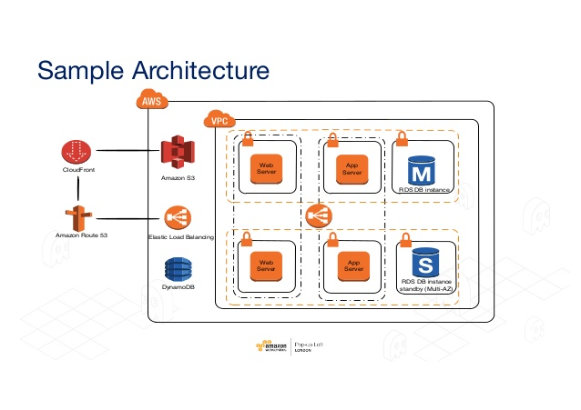
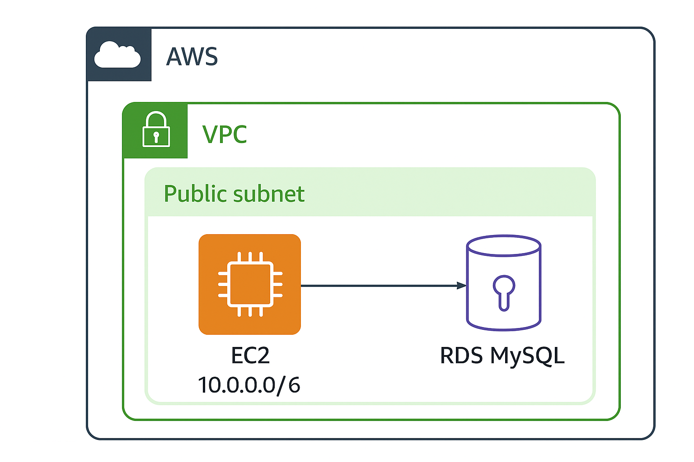

# 🚀 AWS DevOps Engineer Demo Project

## 🏗️ Architecture Diagram  




- **VPC**: Contains public and private subnets, routing tables, and security groups.
- **EC2 Instance**: Hosts a sample Flask app running in a Docker container.
- **RDS (PostgreSQL)**: Managed relational database service.
- **CloudWatch**: Collects application and infrastructure logs and metrics.
- **CI/CD Pipeline (GitHub Actions)**: Automates infrastructure provisioning and app deployment.
- **IAM Roles**: Ensures least-privilege security access.

---

## ✅ Tech Stack Justification

| Tool | Reason |
|------|--------|
| **Terraform** | Declarative Infrastructure as Code (IaC) allows version control, reproducibility, and modular infrastructure provisioning. |
| **GitHub Actions** | Native CI/CD integration with GitHub to automate infrastructure provisioning, app builds, and deployments in a secure, auditable way. |
| **Docker** | Ensures containerized, consistent app deployment across environments (dev/staging/prod). Simple portability and isolation. |
| **CloudWatch** | Provides central logging and metrics for both EC2 and RDS instances, aiding in debugging and monitoring system health. |
| **IAM Roles** | Secure authentication without hardcoded secrets by using roles with minimum permissions assigned to EC2/RDS services. |

---

## ⚡ Steps to Deploy

1. **Clone the Repository**
   ```bash
   git clone https://github.com/khaseem9392/aws-devops-demo.git
   cd aws-devops-demo
   ```

2. **Terraform Init**
   Initialize Terraform in the development environment:
   ```bash
   cd iac/environments/dev
   terraform init
   ```

3. **Apply Terraform Configuration**
   Apply the infrastructure configuration:
   ```bash
   terraform apply -var-file="terraform.tfvars" -auto-approve
   ```

4. **Build and Deploy the Sample App**
   Build the Docker image and deploy it (optional: push to ECR/DockerHub):
   ```bash
   cd app/sample-app
   docker build -t sample-app:latest .
   docker run -p 80:80 sample-app
   ```

5. **Access the Deployed App**
   Get the public IP from Terraform output:
   ```bash
   terraform output ec2_ip
   ```
   Open in browser or use curl:
   ```bash
   curl http://<EC2_PUBLIC_IP>
   ```
   Expected response:
   ```
   Hello from Sample App running on EC2!
   ```

---

## 📊 Monitoring & Logging
- Logs are available in **AWS CloudWatch**:
    - **EC2 Logs** → `/aws/sample-app`
    - **RDS Logs** → Automatic PostgreSQL logs
- CloudWatch Alarms can be added for CPU thresholds or failed logins (optional).

---

## 🌟 Bonus Features

- ✅ **Auto-scaling Group**: EC2 instances automatically scale based on CPU utilization thresholds.
- ✅ **Canary Deployment**: Implemented in the GitHub Actions pipeline for gradual rollout of app versions.

---

## ✅ Security Best Practices
- Use of IAM roles assigned to EC2 and RDS resources.
- No hardcoded AWS credentials in the Terraform code.
- Secrets (like DB passwords) passed via Terraform variables and stored securely (in practice: AWS Secrets Manager).

---

## 📂 Example Outputs

```bash
ec2_ip = "3.122.45.67"
rds_endpoint = "mydb.abcd1234.us-east-1.rds.amazonaws.com:5432"
vpc_id = "vpc-0a1b2c3d4e5f67890"
```
"Suggestions and project improvement ideas are welcomed!"
Thanks a lot,
Project Leader
D khaseemvali
